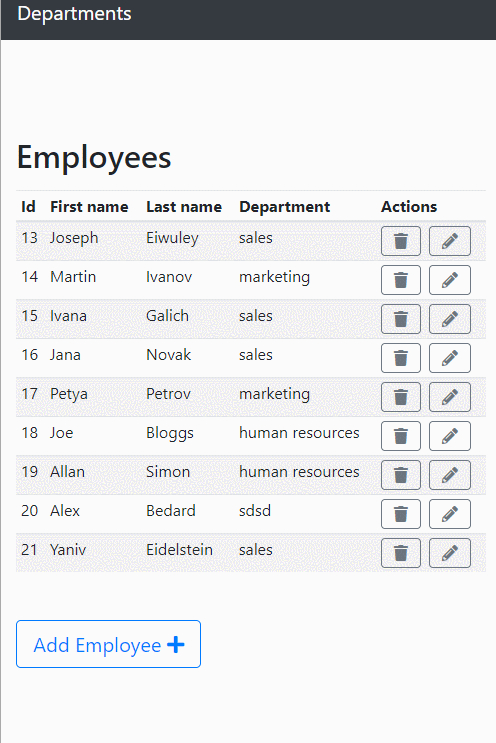
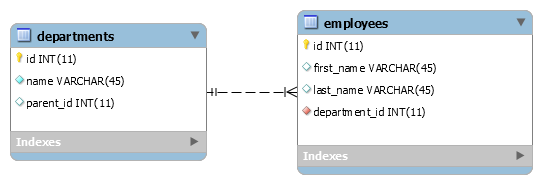

# Department management.

    This is a simple java web application that uses servlet, jsp, jdbc bootstrap 4, jQuery and ajax.
    It was created as test work for the MetaPrime


### Instructions for creating the schema and tables required to run the application.
**For creating the schema and tables in MYSQL:**
``` sql
CREATE SCHEMA IF NOT EXISTS `department_management` DEFAULT CHARACTER SET utf8 ;
```
``` sql
CREATE TABLE `department_management`.`departments` (
  `id` INT NOT NULL AUTO_INCREMENT,
  `name` VARCHAR(45) NOT NULL,
  `parent_id` INT NULL,
  PRIMARY KEY (`id`));git 
```

``` sql
CREATE TABLE `department_management`.`employees` (
  `id` INT NOT NULL AUTO_INCREMENT,
  `first_name` VARCHAR(45) NULL,
  `last_name` VARCHAR(45) NULL,
  `department_id` INT NOT NULL,
  PRIMARY KEY (`id`))
  CONSTRAINT `employees_departments_fk`
    FOREIGN KEY (`department_id`)
    REFERENCES `department_management`.`departments` (`id`)
    ON DELETE NO ACTION
    ON UPDATE NO ACTION;
```

